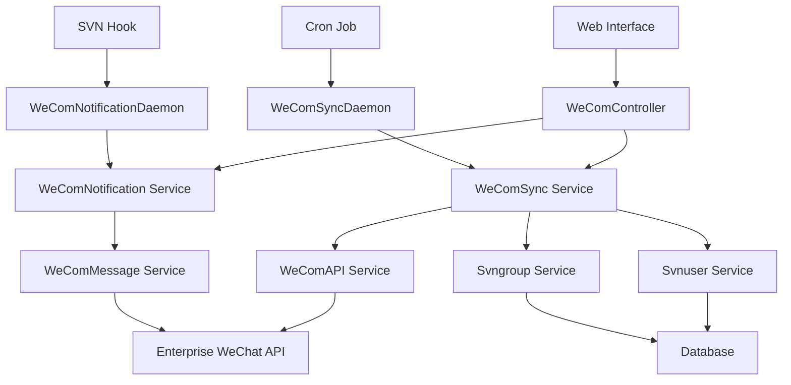

# Design Document

## Overview

企业微信集成功能是 SVNAdmin 系统的核心扩展模块，采用模块化设计原则，在不影响现有 SVN 管理功能的前提下，提供企业微信组织架构同步、用户身份匹配、动态权限管理和实时通知功能。

该设计遵循现有系统的 MVC 架构模式，通过新增独立的控制器、服务层和数据模型来实现企业微信集成，同时利用现有的用户管理、权限系统和通知机制，确保系统的一致性和可维护性。

## Steering Document Alignment

### Technical Standards (tech.md)

**遵循现有技术栈:**
- 使用 PHP 7.2+ 保持与现有代码的兼容性
- 采用 PDO 数据库抽象层支持 SQLite/MySQL 双数据库
- 利用现有的 Apache HTTP Server 和 SVN 集成架构
- 遵循 PSR-12 编码标准和现有的错误处理机制

**守护进程架构扩展:**
- 扩展现有的 `svnadmind.php` 守护进程，添加企业微信同步任务
- 新增独立的企业微信通知守护进程，处理实时通知发送
- 采用现有的 IPC 机制进行进程间通信

### Project Structure (structure.md)

**目录组织遵循现有模式:**
- 控制器放置在 `02.php/app/controller/` 目录
- 服务层放置在 `02.php/app/service/` 目录  
- 配置文件放置在 `02.php/config/` 目录
- Web 界面放置在 `01.web/` 目录下的 `wecom/` 子目录

**命名约定:**
- PHP 类使用 PascalCase: `WeComAPI`, `WeComSync`
- PHP 方法使用 camelCase: `syncDepartments()`, `sendNotification()`
- 配置文件使用 snake_case: `wecom.php`

## Code Reuse Analysis

### Existing Components to Leverage

- **Svnuser Service**: 扩展现有用户管理服务，添加企业微信用户同步功能
- **Svngroup Service**: 利用现有组管理服务，实现部门到用户组的映射
- **Base Controller/Service**: 继承现有基础类，保持统一的错误处理和数据库访问模式
- **Apache Service**: 利用现有 Apache 配置管理，更新 SVN 权限文件
- **Logs Service**: 扩展现有日志服务，添加企业微信操作日志

### Integration Points

- **用户管理系统**: 通过现有 `svn_users` 表扩展字段，存储企业微信用户映射信息
- **权限系统**: 利用现有 authz 文件生成机制，根据企业微信部门关系动态生成权限
- **数据库层**: 扩展现有数据库结构，新增企业微信相关表
- **配置系统**: 利用现有配置管理机制，添加企业微信 API 配置

## Architecture

企业微信集成采用分层架构设计，包含 API 交互层、业务逻辑层、数据访问层和通知服务层。每层职责明确，通过标准接口进行交互，确保模块的可测试性和可维护性。

### Modular Design Principles

- **Single File Responsibility**: 每个文件专注单一功能（API 调用、数据同步、通知发送等）
- **Component Isolation**: 企业微信功能完全独立，可通过配置开关禁用
- **Service Layer Separation**: 明确分离 API 交互、业务逻辑和数据持久化
- **Utility Modularity**: 工具函数按功能域分组，便于复用和测试



## Components and Interfaces

### WeComAPI Service
- **Purpose:** 封装企业微信 API 调用，处理认证、请求和响应
- **Interfaces:** 
  - `getDepartments()`: 获取部门列表
  - `getUsers($departmentId)`: 获取部门用户
  - `sendMessage($chatId, $message)`: 发送群消息
- **Dependencies:** cURL, 企业微信 API 凭证
- **Reuses:** 现有的配置管理和日志记录机制

### WeComSync Service
- **Purpose:** 处理企业微信数据与 SVN 系统的同步逻辑
- **Interfaces:**
  - `syncDepartments()`: 同步部门结构到用户组
  - `syncUsers()`: 同步用户信息和部门关系
  - `updatePermissions()`: 根据同步结果更新 SVN 权限
- **Dependencies:** WeComAPI, Svnuser Service, Svngroup Service
- **Reuses:** 现有的用户管理和权限管理服务

### WeComNotification Service
- **Purpose:** 管理 SVN 操作的企业微信通知规则和发送
- **Interfaces:**
  - `configureRule($repoPath, $chatId, $events)`: 配置通知规则
  - `processNotification($event, $data)`: 处理通知事件
  - `sendNotification($rule, $message)`: 发送通知消息
- **Dependencies:** WeComAPI, 通知规则配置
- **Reuses:** 现有的 SVN 钩子机制和日志服务

### WeComController
- **Purpose:** 提供企业微信集成的 Web 管理界面
- **Interfaces:**
  - `syncStatus()`: 显示同步状态页面
  - `configApi()`: API 配置页面
  - `manageRules()`: 通知规则管理页面
- **Dependencies:** WeComSync Service, WeComNotification Service
- **Reuses:** 现有的 Web 框架和认证机制

## Data Models

### wecom_config 表
```sql
CREATE TABLE wecom_config (
    id INTEGER PRIMARY KEY AUTOINCREMENT,
    corp_id VARCHAR(255) NOT NULL,           -- 企业微信企业ID
    corp_secret VARCHAR(255) NOT NULL,       -- 企业微信应用密钥
    agent_id VARCHAR(255) NOT NULL,          -- 企业微信应用ID
    sync_enabled BOOLEAN DEFAULT 1,          -- 是否启用同步
    sync_interval INTEGER DEFAULT 3600,      -- 同步间隔（秒）
    last_sync_time DATETIME,                 -- 最后同步时间
    created_at DATETIME DEFAULT CURRENT_TIMESTAMP,
    updated_at DATETIME DEFAULT CURRENT_TIMESTAMP
);
```

### wecom_departments 表
```sql
CREATE TABLE wecom_departments (
    id INTEGER PRIMARY KEY AUTOINCREMENT,
    wecom_dept_id VARCHAR(255) NOT NULL,     -- 企业微信部门ID
    dept_name VARCHAR(255) NOT NULL,         -- 部门名称
    parent_id VARCHAR(255),                  -- 父部门ID
    svn_group_name VARCHAR(255),             -- 对应的SVN用户组名
    is_active BOOLEAN DEFAULT 1,             -- 是否激活
    created_at DATETIME DEFAULT CURRENT_TIMESTAMP,
    updated_at DATETIME DEFAULT CURRENT_TIMESTAMP,
    UNIQUE(wecom_dept_id)
);
```

### wecom_users 表
```sql
CREATE TABLE wecom_users (
    id INTEGER PRIMARY KEY AUTOINCREMENT,
    wecom_user_id VARCHAR(255) NOT NULL,     -- 企业微信用户ID
    svn_username VARCHAR(255),               -- 对应的SVN用户名
    real_name VARCHAR(255),                  -- 真实姓名
    mobile VARCHAR(20),                      -- 手机号
    email VARCHAR(255),                      -- 邮箱
    department_ids TEXT,                     -- 所属部门ID列表（JSON）
    is_active BOOLEAN DEFAULT 1,             -- 是否激活
    last_sync_time DATETIME,                 -- 最后同步时间
    created_at DATETIME DEFAULT CURRENT_TIMESTAMP,
    updated_at DATETIME DEFAULT CURRENT_TIMESTAMP,
    UNIQUE(wecom_user_id)
);
```

### wecom_notification_rules 表
```sql
CREATE TABLE wecom_notification_rules (
    id INTEGER PRIMARY KEY AUTOINCREMENT,
    rule_name VARCHAR(255) NOT NULL,         -- 规则名称
    repo_path VARCHAR(500),                  -- 仓库路径（支持通配符）
    events TEXT NOT NULL,                    -- 监听的事件类型（JSON数组）
    chat_id VARCHAR(255) NOT NULL,           -- 企业微信群ID
    message_template TEXT,                   -- 消息模板
    is_enabled BOOLEAN DEFAULT 1,            -- 是否启用
    created_by VARCHAR(255),                 -- 创建者
    created_at DATETIME DEFAULT CURRENT_TIMESTAMP,
    updated_at DATETIME DEFAULT CURRENT_TIMESTAMP
);
```

## Error Handling

### Error Scenarios

1. **企业微信 API 调用失败**
   - **Handling:** 实现指数退避重试机制，记录详细错误日志，降级到本地缓存数据
   - **User Impact:** 显示同步状态异常，提供手动重试选项

2. **用户匹配失败**
   - **Handling:** 记录未匹配用户列表，提供手动映射界面，支持批量导入映射关系
   - **User Impact:** 在管理界面显示未匹配用户数量，提供映射管理入口

3. **权限同步冲突**
   - **Handling:** 备份原有权限配置，提供冲突解决策略选择，支持回滚操作
   - **User Impact:** 显示权限变更预览，需要管理员确认后执行

4. **通知发送失败**
   - **Handling:** 实现消息队列机制，支持重试和死信队列，记录发送状态
   - **User Impact:** 在通知规则管理界面显示发送统计和失败详情

## Testing Strategy

### Unit Testing

**核心组件测试:**
- WeComAPI Service: 模拟企业微信 API 响应，测试各种成功和失败场景
- WeComSync Service: 测试数据同步逻辑，包括增量同步和全量同步
- 数据映射逻辑: 测试用户匹配算法和部门层级处理

**测试工具:**
- 使用 PHPUnit 进行单元测试
- 创建 Mock 对象模拟外部依赖
- 使用内存数据库进行数据层测试

### Integration Testing

**系统集成测试:**
- 企业微信 API 集成测试（使用测试企业微信账号）
- 数据库操作集成测试（SQLite 和 MySQL）
- SVN 权限文件生成和应用测试

**测试环境:**
- 搭建独立的测试环境，包含完整的 SVN 服务器
- 使用 Docker 容器确保测试环境的一致性
- 模拟不同规模的组织架构进行压力测试

### End-to-End Testing

**用户场景测试:**
- 完整的同步流程：从企业微信获取数据到 SVN 权限生效
- 通知流程：从 SVN 操作触发到企业微信消息接收
- 管理界面操作：配置、监控、故障排查的完整流程

**自动化测试:**
- 使用 Selenium 进行 Web 界面自动化测试
- 编写脚本模拟 SVN 操作，验证通知功能
- 定期执行回归测试，确保新功能不影响现有功能