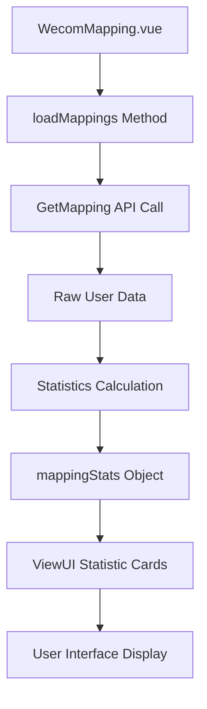

# Design Document

## Overview

This design addresses the bug in the WeCom user mapping statistics display where statistical cards show empty circular icons instead of numerical data. The solution involves fixing the data flow from API response to UI display, ensuring proper calculation and rendering of statistics in the Vue.js frontend component.

## Steering Document Alignment

### Technical Standards (tech.md)
The design follows Vue.js 2.x patterns used throughout the project, maintaining consistency with existing component architecture and data binding practices.

### Project Structure (structure.md)
The implementation will modify the existing WecomMapping.vue component within the established frontend structure at `01.web/src/views/wecom/components/`.

## Code Reuse Analysis

### Existing Components to Leverage
- **WecomMapping.vue**: The main component that already contains the statistical display template and data structure
- **ViewUI Statistic Component**: Already implemented for displaying statistical cards with icons and values
- **API Service Layer**: Existing axios-based API calls to `WeComAdmin` controller

### Integration Points
- **GetMapping API**: Existing endpoint that returns user mapping data from PHP backend
- **Vue.js Data Binding**: Existing reactive data system for `mappingStats` object
- **Component Lifecycle**: Existing `mounted()` and method structure for data loading

## Architecture

The bug fix follows the existing MVVM (Model-View-ViewModel) pattern used in the Vue.js application. The solution maintains separation of concerns between data fetching, processing, and presentation.

### Modular Design Principles
- **Single File Responsibility**: WecomMapping.vue handles user mapping display and statistics
- **Component Isolation**: Statistics calculation isolated within the loadMappings method
- **Service Layer Separation**: API calls remain separate from business logic
- **Utility Modularity**: Statistical calculations are self-contained within the component



## Components and Interfaces

### WecomMapping Component
- **Purpose:** Display WeCom user mapping interface with statistics and user list
- **Interfaces:** 
  - `loadMappings()`: Fetches and processes user mapping data
  - `mappingStats`: Reactive data object containing calculated statistics
- **Dependencies:** axios for API calls, ViewUI for UI components
- **Reuses:** Existing API service patterns and Vue.js reactive data system

### Statistics Calculation Logic
- **Purpose:** Calculate user mapping statistics from raw API data
- **Interfaces:** 
  - Input: Array of user objects from GetMapping API
  - Output: mappingStats object with totals and percentages
- **Dependencies:** None (pure calculation logic)
- **Reuses:** Existing data processing patterns in the component

## Data Models

### User Object (from API)
```javascript
{
  wecom_userid: string,           // Enterprise WeChat user ID
  wecom_name: string,            // User display name
  svn_user_name: string|null,    // SVN username (null if unmapped)
  wecom_department_ids: string,  // Department information
  // ... other user properties
}
```

### MappingStats Object
```javascript
{
  wecom_users_total: number,     // Total Enterprise WeChat users
  mapped_users: number,          // Users with SVN accounts
  unmapped_users: number,        // Users without SVN accounts  
  mapping_rate: number          // Percentage of mapped users (0-100)
}
```

## Error Handling

### Error Scenarios
1. **API Request Failure:** GetMapping API returns error or network failure
   - **Handling:** Catch exception, log error, display user-friendly message
   - **User Impact:** Error message displayed, statistics remain at default values (0)

2. **Invalid API Response:** API returns malformed or missing user data
   - **Handling:** Validate data structure, use empty array as fallback
   - **User Impact:** Statistics show 0 values, no user list displayed

3. **Calculation Errors:** Edge cases in statistics calculation (division by zero, etc.)
   - **Handling:** Use safe calculation methods with proper null checks
   - **User Impact:** Statistics display correctly even with edge case data

## Testing Strategy

### Unit Testing
- Test statistics calculation logic with various data scenarios
- Test API response handling for success and error cases
- Test edge cases: empty data, all mapped, all unmapped users

### Integration Testing
- Test complete data flow from API call to UI display
- Test statistics updates when data changes
- Test that filtering doesn't affect statistics calculation

### End-to-End Testing
- Test user navigation to WeCom mapping page
- Verify statistics display correctly on page load
- Test statistics remain accurate during user interactions

## Implementation Details

### Root Cause Analysis
The current bug occurs because:
1. Statistics calculation may not be triggered properly in `loadMappings()`
2. The `mappingStats` object may not be updated with calculated values
3. Frontend build process may not include the latest code changes

### Solution Approach
1. **Fix Statistics Calculation**: Ensure `loadMappings()` properly calculates and assigns statistics
2. **Add Debug Logging**: Include console logging for troubleshooting
3. **Verify Data Flow**: Ensure API data flows correctly to UI components
4. **Frontend Build Process**: Ensure latest code changes are included in built assets

### Key Changes Required
- Modify `loadMappings()` method in WecomMapping.vue
- Add proper statistics calculation after API data processing
- Include debug logging for development troubleshooting
- Ensure frontend build process includes latest changes