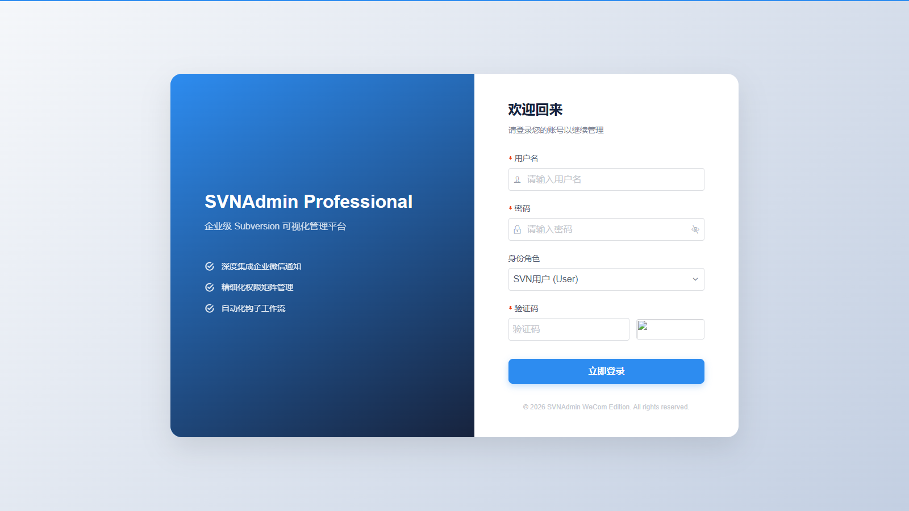
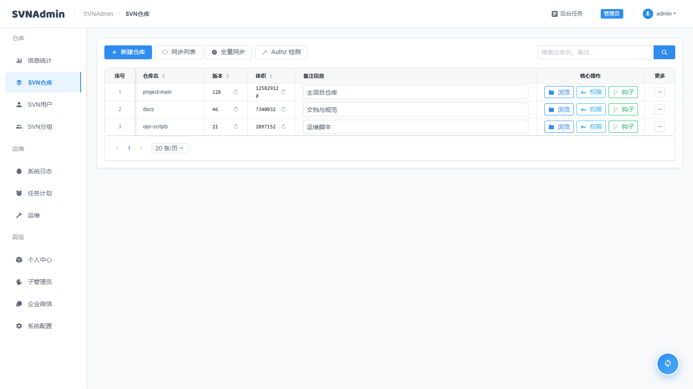
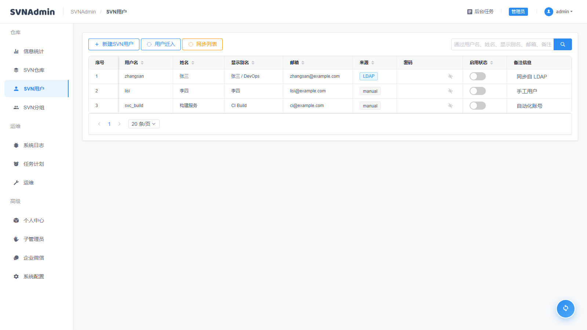
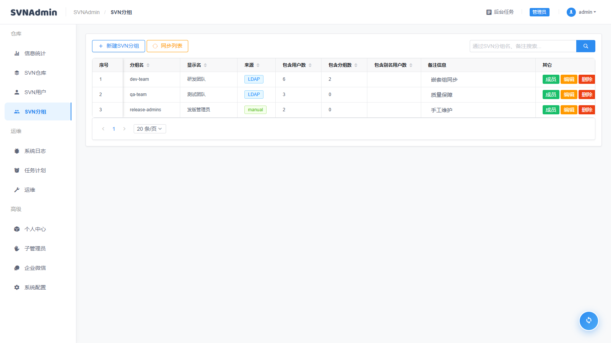
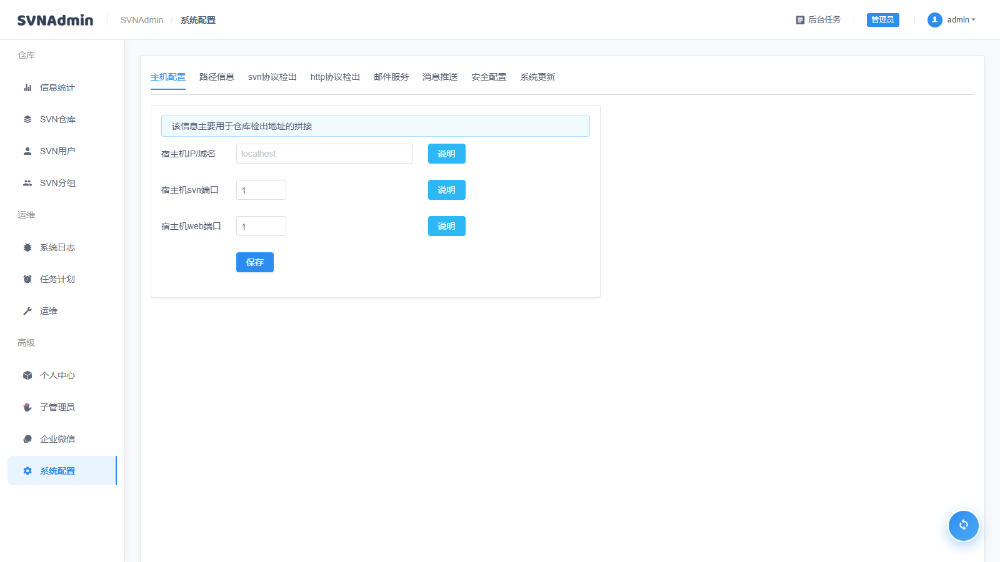
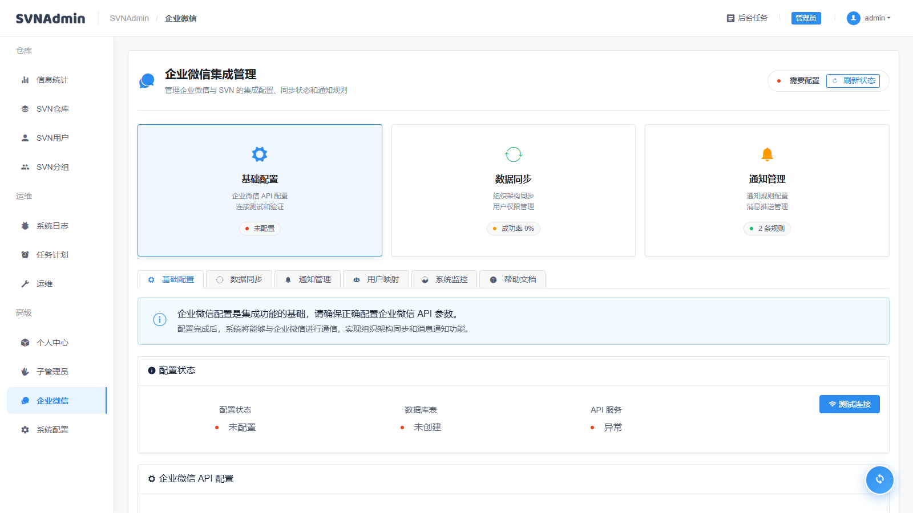

# SVNAdmin WeCom Edition

本项目基于 [witersen/SvnAdminV2.0](https://github.com/witersen/SvnAdminV2.0) 做企业场景增强，重点补充 Docker 部署、企业微信集成、LDAP 用户/分组同步、姓名字段、仓库权限管理一致性以及升级迁移能力。

## 联系方式

原项目Q群：633108141
关注微信公众号：大刘讲IT

## 功能概览

- SVN 仓库、用户、分组、路径权限的 Web 管理。
- Docker 一键部署，容器启动时自动执行幂等迁移和运行时数据修复。
- 企业微信配置、通知规则、通知日志和 API 调用日志管理。
- LDAP 用户同步、LDAP 分组同步、嵌套组成员展开、字段映射同步。
- 用户姓名、显示别名、邮箱、来源等字段在用户列表、授权选择、搜索和权限页面中统一展示。
- Authz 文件重复 section 修复、passwd/authz 初始化修复、svnauthz 校验和部署自检。
- 前端表格列宽拖拽能力统一到仓库、用户、分组、授权弹窗等管理表格。

## 界面预览

登录页：



仓库列表：



用户列表：



分组列表：



系统配置：



企业微信配置：



## 快速启动

先构建前端静态文件：

```bash
cd 01.web
npm install
npm run build
cd ..
```

再启动 Docker 开发测试环境：

```bash
docker compose -f docker-compose.optimized.yml up -d --build
```

默认访问地址：

- Web 管理端：http://localhost:8080
- SVN 协议端口：svn://localhost:3690

首次初始化账号通常为 `admin/admin`，部署后请立即修改管理员密码。

## 部署自检

容器启动后建议执行：

```bash
docker exec svnadmin-local-optimized php /var/www/html/scripts/preflight.php
docker logs --tail 120 svnadmin-local-optimized
```

自检脚本会检查：

- 应用目录、数据库和核心表结构。
- SVN 用户、分组、企业微信相关迁移字段。
- `/home/svnadmin` 下的 `svnadmin.db`、`passwd`、`authz`、`svnserve.conf`。
- `svnserve`、`svnadmin`、`svnlook`、`svnauthz`、`svnauthz-validate` 等二进制命令。
- Authz 文件语法和 svnserve 运行状态。

如果只想验证 PHP 语法：

```bash
php -l 04.update/wecom-ldap-upgrade/migrate.php
php -l scripts/preflight.php
```

## 从原项目升级

适用于已经基于 `https://github.com/witersen/SvnAdminV2.0.git` 部署过的环境。升级前必须备份运行时数据，尤其是数据库、仓库、passwd、authz 和配置文件。

Linux 备份示例：

```bash
cp -a data "data.backup-$(date +%Y%m%d%H%M%S)"
```

PowerShell 备份示例：

```powershell
Copy-Item -Recurse .\data ".\data.backup-$(Get-Date -Format yyyyMMddHHmmss)"
```

推荐升级步骤：

1. 停止旧服务。
2. 备份 `data/` 或生产环境中的 `/home/svnadmin`。
3. 合并或切换到本项目代码，保留原有运行时数据。
4. 重新构建前端：`cd 01.web && npm install && npm run build`。
5. 使用 `docker compose -f docker-compose.optimized.yml up -d --build` 启动。
6. 启动脚本会自动执行 `04.update/wecom-ldap-upgrade/migrate.php`。
7. 执行 `scripts/preflight.php`，确认迁移和运行状态。

源码部署或非 Docker 环境可手工执行迁移：

```bash
php 04.update/wecom-ldap-upgrade/migrate.php
php scripts/preflight.php
```

迁移脚本是幂等设计，可重复执行。执行时会尽量备份 `/home/svnadmin` 下的关键运行时文件到 `backup/upgrade-*` 目录。

## 升级迁移内容

本项目新增的升级脚本会补齐以下内容：

- `svn_users`：姓名、显示别名、邮箱、LDAP DN、外部 ID、来源、同步时间等字段。
- `svn_groups`：显示名称、来源、LDAP DN、外部 ID、同步时间等字段。
- `options`：补齐 LDAP 用户字段映射、LDAP 分组字段映射、嵌套组同步相关默认配置。
- 企业微信：安全创建或补齐 `wecom_config`、`wecom_departments`、`wecom_users`、`wecom_notification_rules`、`wecom_notification_logs`、`wecom_sync_logs`、`wecom_api_logs`、`wecom_notification_queue` 等表结构。
- 兼容旧字段：将早期企业微信配置中的 `secret`、`repo_path`、`is_enabled`、`events` 等字段迁移到新版结构。
- 运行时数据：初始化或修复 `passwd`、`authz`、`svnserve.conf`，避免重复 `[groups]` 导致 authz 无法解析。

不要在已有生产数据库上直接执行旧版 `wecom_tables.sql` 或旧版 `notification_rules_migration.sql`。旧 SQL 中可能包含 `DROP TABLE` 或不兼容字段，会导致历史企业微信配置和通知规则丢失。Docker 启动脚本已经改为使用新的安全迁移入口。

## LDAP 同步建议

推荐把用户和分组来源明确区分：

- 本地用户/分组由 SVNAdmin 手工维护。
- LDAP 用户/分组由同步任务维护，不在 Web 页面中手工覆盖来源字段。
- LDAP 分组允许同步嵌套成员关系，展开后的成员写入 SVNAdmin 分组成员关系。
- LDAP 分组同步会检测与手工分组同名的冲突；发现冲突时会中止同步并返回冲突分组名，避免 LDAP 成员和手工成员被静默合并。
- 授权页面只消费当前已同步完成的用户和分组快照，避免授权时临时查询 LDAP 造成结果不一致。

常用 LDAP 字段映射建议：

| SVNAdmin 字段 | LDAP 常见字段 |
| --- | --- |
| 用户名 | `uid`、`sAMAccountName`、`cn` |
| 姓名 | `cn`、`displayName`、`name` |
| 显示别名 | `displayName`、`cn` |
| 邮箱 | `mail`、`userPrincipalName` |
| 外部 ID | `entryUUID`、`objectGUID` |
| DN | 条目 DN |
| 分组显示名称 | `cn`、`displayName`、`name` |
| 分组成员 | `member`、`uniqueMember`、`memberUid` |

如果企业目录使用嵌套组，建议先在测试环境验证最大递归深度、循环引用处理和成员去重效果，再切换生产同步。

如果 LDAP 分组名与手工分组名重复，建议优先采用统一命名策略，例如给本地手工分组加 `local-` 前缀，或在 LDAP 分组字段映射中使用不会与本地分组冲突的属性。处理完冲突后再重新执行分组同步。

## 项目结构

```text
00.static/                         静态资源
01.web/                            Vue 2 前端项目
02.php/                            PHP 后端项目
03.cicd/svnadmin_docker/           Docker 启动与初始化脚本
04.update/wecom-ldap-upgrade/      企业微信与 LDAP 升级迁移脚本
scripts/preflight.php              部署自检脚本
docs/images/                       README 页面截图
data/                              本地开发运行时数据
Dockerfile.optimized               优化版 Docker 镜像
docker-compose.optimized.yml       开发测试编排文件
```

## 常见问题

### 登录提示目录不存在或不可写

检查容器内 `/home/svnadmin` 是否已初始化，并确认挂载目录权限：

```bash
docker exec svnadmin-local-optimized ls -la /home/svnadmin
docker exec svnadmin-local-optimized php /var/www/html/scripts/preflight.php
```

### svnauthz 提示 `[groups]` 重复

启动脚本会自动修复重复 section。也可以重新执行迁移和自检：

```bash
docker exec svnadmin-local-optimized php /var/www/html/04.update/wecom-ldap-upgrade/migrate.php
docker exec svnadmin-local-optimized php /var/www/html/scripts/preflight.php
```

### 用户或分组列表为空

先确认 `passwd`、`authz`、`svnadmin.db` 是否一致，再执行同步列表或迁移脚本。升级后用户列表会以数据库快照为准，同时保留从 `passwd` 同步出的账号信息。

### LDAP 分组同步提示名称冲突

这表示 LDAP 返回的分组名与 SVNAdmin 手工分组名相同。系统会阻止本次同步，避免两个来源的成员被写入同一个 authz 分组。请重命名手工分组，或调整 LDAP 分组名称映射后重新同步。

### Docker 无法启动或无法连接

确认 Docker Desktop 或 Docker Engine 正在运行：

```bash
docker version
docker compose -f docker-compose.optimized.yml ps
```

Windows 环境如果提示 `dockerDesktopLinuxEngine` 无法连接，需要先启动 Docker Desktop Linux Engine。

## 开发备注

- 前端构建产物位于 `01.web/dist`，Docker 镜像会复制该目录。
- 修改前端后需要重新执行 `npm run build` 并重新构建镜像。
- 修改迁移逻辑后建议同时执行 PHP 语法检查、容器启动和 `scripts/preflight.php`。
- 截图更新时请启动最新前端页面后替换 `docs/images/` 下同名文件。
