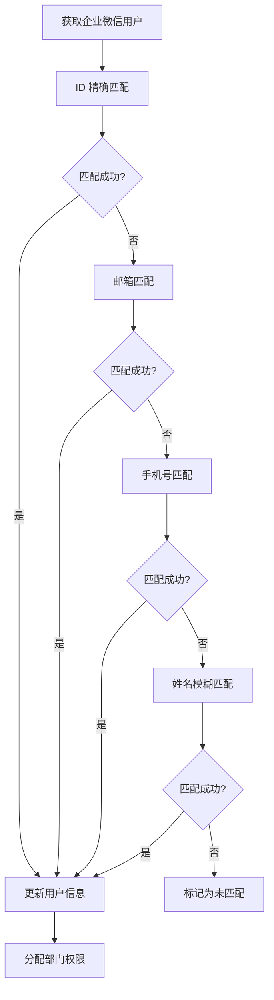

# 企业微信集成使用指南

## 📋 目录

- [概述](#概述)
- [功能特性](#功能特性)
- [系统要求](#系统要求)
- [安装配置](#安装配置)
- [快速开始](#快速开始)
- [功能详解](#功能详解)
- [Web 管理界面](#web-管理界面)
- [命令行工具](#命令行工具)
- [故障排除](#故障排除)
- [常见问题](#常见问题)
- [最佳实践](#最佳实践)
- [API 参考](#api-参考)
- [完整 API 文档](WECOM_API.md)

## 概述

企业微信集成模块为 SVNAdmin 提供了与企业微信的深度集成功能，实现组织架构同步、用户管理、权限控制和实时通知等企业级功能。

### 主要功能

- **🏢 组织架构同步**: 自动同步企业微信部门结构到 SVN 用户组
- **👥 用户身份管理**: 智能匹配企业微信用户与 SVN 账户
- **🔐 权限动态管理**: 基于部门关系的自动权限分配
- **📱 实时消息通知**: SVN 操作的企业微信消息推送
- **📊 统计监控**: 同步状态、通知统计和系统监控
- **🌐 Web 管理界面**: 现代化的配置和管理界面

## 功能特性

### 🔄 自动化同步
- **部门同步**: 保持企业微信部门结构与 SVN 用户组的一致性
- **用户同步**: 自动创建和更新用户信息，支持多种匹配策略
- **权限同步**: 根据部门关系自动分配仓库访问权限
- **增量同步**: 智能检测变更，只同步必要的数据

### 📱 智能通知
- **事件触发**: 支持 commit、delete、revprop-change 等 SVN 事件
- **规则引擎**: 灵活的通知规则配置，支持仓库、路径、用户过滤
- **消息模板**: 可自定义的消息格式和内容
- **批量处理**: 高效的批量通知处理机制
- **失败重试**: 智能重试机制确保消息送达

### 🛡️ 企业级特性
- **多进程架构**: 主守护进程 + 专用通知守护进程
- **消息队列**: 基于数据库的可靠消息传递
- **错误恢复**: 完善的错误处理和恢复机制
- **日志审计**: 详细的操作日志和审计跟踪
- **性能监控**: 实时性能指标和健康检查

## 系统要求

### 基础环境
- **PHP**: 7.2+ (推荐 PHP 8.0+)
- **数据库**: SQLite 3.0+ 或 MySQL 5.7+
- **Web 服务器**: Apache 2.4+ 或 Nginx 1.16+
- **SVN**: Subversion 1.8+
- **操作系统**: Linux (CentOS 7+, Ubuntu 18.04+) 或 Windows Server

### PHP 扩展
```bash
# 必需扩展
php-curl      # HTTP 请求
php-json      # JSON 处理
php-pdo       # 数据库访问
php-sqlite3   # SQLite 支持 (如使用 SQLite)
php-mysqli    # MySQL 支持 (如使用 MySQL)
php-mbstring  # 多字节字符串处理
php-openssl   # SSL/TLS 支持

# 推荐扩展
php-opcache   # 性能优化
php-redis     # 缓存支持 (可选)
```

### 企业微信要求
- **企业微信账号**: 已认证的企业微信账号
- **应用权限**: 通讯录管理权限
- **API 权限**: 企业微信 API 调用权限
- **Webhook**: 群机器人 Webhook 地址 (用于通知)

## 安装配置

### 方法一：自动安装 (推荐)

使用专用的安装脚本进行自动化安装：

```bash
# 进入 SVNAdmin 目录
cd /path/to/svnadmin

# 运行安装脚本
php 02.php/server/wecom_install.php install

# 运行配置向导
php 02.php/server/wecom_setup_wizard.php
```

### 方法二：手动安装

#### 1. 数据库初始化

**SQLite 用户:**
```bash
# 执行 SQLite 数据库脚本
sqlite3 02.php/templete/database/sqlite/svnadmin.db < 02.php/templete/database/sqlite/wecom_tables.sql

# 运行数据库迁移
php 04.update/wecom-integration/database_migration.php
```

**MySQL 用户:**
```bash
# 执行 MySQL 数据库脚本
mysql -u username -p database_name < 02.php/templete/database/mysql/wecom_tables.sql

# 运行数据库迁移
php 04.update/wecom-integration/database_migration.php
```

#### 2. 配置文件设置

复制配置模板并编辑：

```bash
# 复制配置模板
cp 02.php/config/wecom.php.template 02.php/config/wecom.php

# 编辑配置文件
nano 02.php/config/wecom.php
```

#### 3. 企业微信应用配置

在企业微信管理后台创建应用并获取以下信息：

```php
// 02.php/config/wecom.php
return [
    'corp_id' => 'your_corp_id',           // 企业 ID
    'corp_secret' => 'your_corp_secret',   // 应用密钥
    'agent_id' => 'your_agent_id',         // 应用 ID
    // ... 其他配置
];
```

#### 4. SVN 钩子安装

```bash
# 复制钩子脚本到 SVN 仓库
cp 02.php/templete/hooks/wecom_notify/* /path/to/svn/repo/hooks/

# 设置执行权限
chmod +x /path/to/svn/repo/hooks/post-commit
chmod +x /path/to/svn/repo/hooks/post-revprop-change
```

## 快速开始

### 1. 获取企业微信应用信息

1. 登录企业微信管理后台
2. 进入"应用管理" → "自建应用"
3. 创建新应用或选择现有应用
4. 记录以下信息：
   - **企业 ID** (CorpId)
   - **应用密钥** (Secret)
   - **应用 ID** (AgentId)

### 2. 配置 Webhook 地址

1. 在企业微信群中添加机器人
2. 获取 Webhook 地址
3. 在配置中设置 Webhook 地址

### 3. 运行配置向导

```bash
php 02.php/server/wecom_setup_wizard.php
```

按照向导提示完成基础配置。

### 4. 启动守护进程

```bash
# 启动主守护进程 (包含企业微信同步)
php 02.php/server/svnadmind.php start

# 启动通知守护进程
php 02.php/server/wecom_notification_daemon.php start
```

### 5. 执行首次同步

通过 Web 界面或命令行执行首次数据同步：

**Web 界面:**
访问 `http://your-domain/01.web/#/wecom` 进行同步操作。

**命令行:**
```bash
# 执行完整同步
php -r "
require_once '02.php/app/service/WeComSync.php';
\$sync = new WeComSync();
\$sync->syncDepartments();
\$sync->syncUsers();
\$sync->syncPermissions();
"
```

## 功能详解

### 组织架构同步

#### 部门同步机制

企业微信的部门结构会自动映射为 SVN 用户组：

```
企业微信部门          →    SVN 用户组
├── 公司 (ID: 1)     →    wecom_company
├── 技术部 (ID: 2)   →    wecom_technology  
└── 产品部 (ID: 3)   →    wecom_product
```

#### 同步规则

- **命名规则**: `wecom_` + 部门英文名 (自动生成或手动配置)
- **层级关系**: 保持企业微信的部门层级结构
- **权限继承**: 子部门继承父部门的访问权限
- **自动清理**: 删除的部门对应的用户组会被标记为非活跃状态

#### 配置选项

```php
// 02.php/config/wecom.php
'department_mapping' => [
    'auto_create_groups' => true,        // 自动创建用户组
    'group_name_prefix' => 'wecom_',     // 用户组名前缀
    'sync_interval' => 3600,             // 同步间隔 (秒)
    'cleanup_inactive' => true,          // 清理非活跃部门
]
```

### 用户身份管理

#### 用户匹配策略

系统支持多种用户匹配策略：

1. **ID 匹配**: 企业微信 userid 与 SVN 用户名完全匹配
2. **邮箱匹配**: 通过邮箱地址进行匹配
3. **手机号匹配**: 通过手机号码进行匹配
4. **姓名匹配**: 通过真实姓名进行模糊匹配

#### 匹配流程



#### 用户信息同步

匹配成功的用户会同步以下信息：

- **基础信息**: 姓名、邮箱、手机号
- **部门关系**: 所属部门和职位信息
- **状态信息**: 启用状态和最后更新时间
- **扩展字段**: 企业微信 userid 和相关标识

### 权限动态管理

#### 权限分配规则

基于用户的部门关系自动分配 SVN 仓库权限：

```ini
# authz 文件示例
[groups]
wecom_technology = zhangsan, lisi
wecom_product = wangwu, zhaoliu

[/]
@wecom_technology = rw
@wecom_product = r

[/branches/product]
@wecom_product = rw
```

#### 权限映射配置

```php
// 02.php/config/wecom.php
'permission_mapping' => [
    'default_permission' => 'r',         // 默认权限
    'admin_departments' => [1],          // 管理员部门 ID
    'readonly_departments' => [3, 4],    // 只读部门 ID
    'custom_rules' => [
        'wecom_technology' => [
            '/trunk' => 'rw',
            '/branches/dev' => 'rw'
        ]
    ]
]
```

### 实时消息通知

#### 支持的事件类型

- **commit**: 代码提交事件
- **delete**: 文件删除事件
- **revprop-change**: 版本属性修改事件
- **sync-complete**: 同步完成通知
- **error**: 错误事件通知

#### 通知规则配置

通过 Web 界面或数据库配置通知规则：

```sql
INSERT INTO wecom_notification_rules (
    rule_name,
    repo_name,
    event_type,
    webhook_url,
    message_template,
    path_filter,
    user_filter,
    is_enabled
) VALUES (
    '技术部提交通知',
    'project_repo',
    'commit',
    'https://qyapi.weixin.qq.com/cgi-bin/webhook/send?key=xxx',
    '📝 代码提交\n仓库: {repository}\n作者: {author}\n版本: {revision}\n说明: {message}',
    '/trunk,/branches',
    'zhangsan,lisi',
    1
);
```

#### 消息模板变量

支持的模板变量：

- `{repository}`: 仓库名称
- `{revision}`: 版本号
- `{author}`: 提交作者
- `{message}`: 提交说明
- `{date}`: 提交日期
- `{changed_paths}`: 变更文件列表
- `{added_paths}`: 新增文件列表
- `{deleted_paths}`: 删除文件列表
- `{modified_paths}`: 修改文件列表

## Web 管理界面

### 访问方式

通过浏览器访问 SVNAdmin 的 Web 界面，企业微信管理功能位于：

```
http://your-domain/01.web/#/wecom
```

### 主要功能模块

#### 1. 配置管理
- **API 配置**: 企业微信应用信息配置
- **同步配置**: 同步间隔和规则配置
- **通知配置**: 默认通知设置
- **连接测试**: 验证企业微信 API 连接

#### 2. 数据同步
- **同步状态**: 查看当前同步状态和进度
- **手动同步**: 触发立即同步操作
- **同步日志**: 查看详细的同步日志
- **数据预览**: 预览将要同步的数据

#### 3. 通知规则
- **规则列表**: 查看和管理所有通知规则
- **规则编辑**: 创建和编辑通知规则
- **测试通知**: 发送测试消息验证配置
- **统计信息**: 查看通知发送统计

#### 4. 用户映射
- **映射状态**: 查看用户匹配状态
- **手动映射**: 手动建立用户关系
- **批量操作**: 批量导入/导出用户映射
- **匹配规则**: 配置自动匹配规则

#### 5. 系统监控
- **服务状态**: 查看守护进程运行状态
- **性能指标**: 系统性能和资源使用情况
- **错误日志**: 查看系统错误和警告
- **健康检查**: 系统健康状态检查

### 界面操作指南

#### 首次配置

1. **进入配置页面**: 点击"配置管理"标签
2. **填写 API 信息**: 输入企业微信应用的 CorpId、Secret、AgentId
3. **测试连接**: 点击"测试连接"验证配置正确性
4. **保存配置**: 确认无误后保存配置

#### 执行同步

1. **进入同步页面**: 点击"数据同步"标签
2. **查看状态**: 检查当前同步状态
3. **触发同步**: 点击"立即同步"按钮
4. **监控进度**: 实时查看同步进度和结果

#### 配置通知

1. **进入通知页面**: 点击"通知规则"标签
2. **创建规则**: 点击"新增规则"按钮
3. **填写信息**: 配置仓库、事件类型、Webhook 等
4. **测试规则**: 使用"测试通知"功能验证配置
5. **启用规则**: 确认无误后启用规则

## 命令行工具

### 安装和配置

```bash
# 安装企业微信集成
php 02.php/server/wecom_install.php install

# 卸载企业微信集成
php 02.php/server/wecom_install.php uninstall

# 检查安装状态
php 02.php/server/wecom_install.php check

# 修复安装问题
php 02.php/server/wecom_install.php repair

# 运行配置向导
php 02.php/server/wecom_setup_wizard.php
```

### 守护进程管理

```bash
# 启动主守护进程
php 02.php/server/svnadmind.php start

# 停止主守护进程
php 02.php/server/svnadmind.php stop

# 重启主守护进程
php 02.php/server/svnadmind.php restart

# 查看守护进程状态
php 02.php/server/svnadmind.php status

# 启动通知守护进程
php 02.php/server/wecom_notification_daemon.php start

# 停止通知守护进程
php 02.php/server/wecom_notification_daemon.php stop
```

### 数据同步操作

```bash
# 手动执行部门同步
php -r "
require_once '02.php/app/service/WeComSync.php';
\$sync = new WeComSync();
\$result = \$sync->syncDepartments();
echo json_encode(\$result, JSON_PRETTY_PRINT);
"

# 手动执行用户同步
php -r "
require_once '02.php/app/service/WeComSync.php';
\$sync = new WeComSync();
\$result = \$sync->syncUsers();
echo json_encode(\$result, JSON_PRETTY_PRINT);
"

# 手动执行权限同步
php -r "
require_once '02.php/app/service/WeComSync.php';
\$sync = new WeComSync();
\$result = \$sync->syncPermissions();
echo json_encode(\$result, JSON_PRETTY_PRINT);
"
```

### 通知测试

```bash
# 发送测试通知
php -r "
require_once '02.php/app/service/WeComNotification.php';
\$notification = new WeComNotification();
\$eventData = [
    'repository' => 'test_repo',
    'revision' => '1001',
    'author' => 'testuser',
    'message' => 'Test commit message'
];
\$result = \$notification->sendSvnNotification('commit', \$eventData);
echo json_encode(\$result, JSON_PRETTY_PRINT);
"
```

## 故障排除

### 常见问题诊断

#### 1. API 连接问题

**症状**: 无法连接企业微信 API，返回网络错误

**排查步骤**:
```bash
# 检查网络连接
curl -I https://qyapi.weixin.qq.com

# 检查 PHP curl 扩展
php -m | grep curl

# 测试 API 连接
php -r "
require_once '02.php/app/service/WeComAPI.php';
\$api = new WeComAPI();
\$token = \$api->getAccessToken();
echo 'Access Token: ' . \$token . PHP_EOL;
"
```

**解决方案**:
- 检查防火墙设置，确保可以访问企业微信 API
- 验证企业微信应用配置是否正确
- 检查 PHP curl 扩展是否正常工作

#### 2. 同步失败问题

**症状**: 部门或用户同步失败，日志显示错误信息

**排查步骤**:
```bash
# 查看同步日志
tail -f 02.php/logs/wecom_sync.log

# 检查数据库连接
php -r "
require_once '02.php/config/database.php';
try {
    \$pdo = new PDO(\$dsn, \$username, \$password);
    echo 'Database connection OK' . PHP_EOL;
} catch (Exception \$e) {
    echo 'Database error: ' . \$e->getMessage() . PHP_EOL;
}
"

# 手动测试同步
php -r "
require_once '02.php/app/service/WeComSync.php';
\$sync = new WeComSync();
\$result = \$sync->syncDepartments();
print_r(\$result);
"
```

**解决方案**:
- 检查数据库表是否正确创建
- 验证企业微信应用权限是否充足
- 检查同步配置是否正确

#### 3. 通知发送失败

**症状**: SVN 操作后没有收到企业微信通知

**排查步骤**:
```bash
# 检查 SVN 钩子是否正确安装
ls -la /path/to/svn/repo/hooks/post-commit

# 检查钩子脚本权限
chmod +x /path/to/svn/repo/hooks/post-commit

# 查看通知日志
tail -f 02.php/logs/wecom_notification.log

# 测试通知发送
php 02.php/app/script/wecom_notify.php commit /path/to/repo 1001
```

**解决方案**:
- 确保 SVN 钩子脚本已正确安装并具有执行权限
- 检查 Webhook 地址是否正确
- 验证通知规则配置是否匹配

#### 4. 守护进程问题

**症状**: 守护进程无法启动或异常退出

**排查步骤**:
```bash
# 检查进程状态
ps aux | grep svnadmind
ps aux | grep wecom_notification_daemon

# 查看守护进程日志
tail -f 02.php/logs/svnadmind.log
tail -f 02.php/logs/wecom_notification_daemon.log

# 检查 PID 文件
ls -la 02.php/templete/pid/
```

**解决方案**:
- 检查 PHP 进程控制扩展 (pcntl) 是否可用
- 确保日志和 PID 目录具有写权限
- 检查系统资源是否充足

### 日志文件位置

系统日志文件位置：

```
02.php/logs/
├── wecom_api.log              # API 调用日志
├── wecom_sync.log             # 同步操作日志
├── wecom_notification.log     # 通知发送日志
├── svnadmind.log             # 主守护进程日志
└── wecom_notification_daemon.log # 通知守护进程日志
```

### 调试模式

启用调试模式获取更详细的日志信息：

```php
// 02.php/config/wecom.php
'debug' => true,
'log_level' => 'DEBUG',
```

## 常见问题

### Q1: 如何获取企业微信应用的 CorpId 和 Secret？

**A**: 
1. 登录企业微信管理后台 (work.weixin.qq.com)
2. 进入"应用管理" → "应用" → "自建"
3. 创建新应用或选择现有应用
4. 在应用详情页面可以看到 AgentId 和 Secret
5. CorpId 在"我的企业" → "企业信息"中查看

### Q2: 为什么部分用户无法自动匹配？

**A**: 用户匹配失败的常见原因：
- 企业微信 userid 与 SVN 用户名不一致
- 邮箱地址不匹配或为空
- 用户在企业微信中被禁用
- 匹配规则配置不当

**解决方案**：
- 使用 Web 界面的用户映射功能手动建立关系
- 调整匹配规则配置
- 统一用户命名规范

### Q3: 如何自定义通知消息格式？

**A**: 通过修改消息模板实现：
1. 进入 Web 管理界面的"通知规则"页面
2. 编辑或创建通知规则
3. 在"消息模板"字段中使用支持的变量
4. 支持 Markdown 格式和企业微信消息格式

### Q4: 守护进程意外停止怎么办？

**A**: 
1. 检查系统日志确定停止原因
2. 确保系统资源充足 (内存、磁盘空间)
3. 检查 PHP 配置 (内存限制、执行时间)
4. 使用系统服务管理器 (systemd) 实现自动重启

### Q5: 如何备份和恢复企业微信集成配置？

**A**: 
```bash
# 备份配置
cp 02.php/config/wecom.php wecom.php.backup

# 备份数据库 (SQLite)
cp 02.php/templete/database/sqlite/svnadmin.db svnadmin.db.backup

# 恢复配置
cp wecom.php.backup 02.php/config/wecom.php

# 恢复数据库 (SQLite)
cp svnadmin.db.backup 02.php/templete/database/sqlite/svnadmin.db
```

### Q6: 如何处理大量用户的同步性能问题？

**A**: 性能优化建议：
- 调整同步间隔，避免过于频繁的同步
- 使用增量同步而非全量同步
- 优化数据库索引
- 考虑使用缓存机制
- 分批处理大量数据

### Q7: 企业微信 API 调用频率限制怎么处理？

**A**: 
- 实现 API 调用频率控制
- 使用缓存减少不必要的 API 调用
- 批量处理相关操作
- 监控 API 调用次数和响应时间

## 最佳实践

### 部署建议

#### 1. 生产环境配置

```php
// 02.php/config/wecom.php - 生产环境配置
return [
    // 基础配置
    'corp_id' => 'your_corp_id',
    'corp_secret' => 'your_corp_secret',
    'agent_id' => 'your_agent_id',
    
    // 性能优化
    'cache_enabled' => true,
    'cache_ttl' => 3600,
    'batch_size' => 100,
    
    // 安全配置
    'debug' => false,
    'log_level' => 'INFO',
    'token_refresh_threshold' => 300,
    
    // 同步配置
    'sync' => [
        'department_interval' => 3600,    // 1小时
        'user_interval' => 1800,          // 30分钟
        'permission_interval' => 3600,    // 1小时
        'cleanup_interval' => 86400,      // 24小时
    ],
    
    // 通知配置
    'notification' => [
        'queue_enabled' => true,
        'max_retries' => 3,
        'retry_interval' => 300,
        'batch_processing' => true,
    ]
];
```

#### 2. 系统服务配置

创建 systemd 服务文件：

```ini
# /etc/systemd/system/svnadmin-wecom.service
[Unit]
Description=SVNAdmin WeChat Integration Daemon
After=network.target

[Service]
Type=forking
User=www-data
Group=www-data
WorkingDirectory=/path/to/svnadmin
ExecStart=/usr/bin/php 02.php/server/svnadmind.php start
ExecStop=/usr/bin/php 02.php/server/svnadmind.php stop
ExecReload=/usr/bin/php 02.php/server/svnadmind.php restart
PIDFile=/path/to/svnadmin/02.php/templete/pid/svnadmind.pid
Restart=always
RestartSec=10

[Install]
WantedBy=multi-user.target
```

```ini
# /etc/systemd/system/svnadmin-wecom-notification.service
[Unit]
Description=SVNAdmin WeChat Notification Daemon
After=network.target

[Service]
Type=forking
User=www-data
Group=www-data
WorkingDirectory=/path/to/svnadmin
ExecStart=/usr/bin/php 02.php/server/wecom_notification_daemon.php start
ExecStop=/usr/bin/php 02.php/server/wecom_notification_daemon.php stop
PIDFile=/path/to/svnadmin/02.php/templete/pid/wecom_notification_daemon.pid
Restart=always
RestartSec=10

[Install]
WantedBy=multi-user.target
```

启用服务：
```bash
sudo systemctl enable svnadmin-wecom
sudo systemctl enable svnadmin-wecom-notification
sudo systemctl start svnadmin-wecom
sudo systemctl start svnadmin-wecom-notification
```

#### 3. 监控和告警

设置监控脚本：

```bash
#!/bin/bash
# monitor_wecom.sh

# 检查守护进程状态
if ! pgrep -f "svnadmind.php" > /dev/null; then
    echo "WARNING: SVNAdmin daemon is not running"
    systemctl restart svnadmin-wecom
fi

if ! pgrep -f "wecom_notification_daemon.php" > /dev/null; then
    echo "WARNING: WeChat notification daemon is not running"
    systemctl restart svnadmin-wecom-notification
fi

# 检查日志错误
error_count=$(tail -n 100 /path/to/svnadmin/02.php/logs/wecom_*.log | grep -c "ERROR")
if [ $error_count -gt 10 ]; then
    echo "WARNING: High error count in WeChat integration logs: $error_count"
fi

# 检查数据库连接
php -r "
require_once '/path/to/svnadmin/02.php/config/database.php';
try {
    \$pdo = new PDO(\$dsn, \$username, \$password);
    echo 'Database OK';
} catch (Exception \$e) {
    echo 'Database ERROR: ' . \$e->getMessage();
    exit(1);
}
"
```

#### 4. 备份策略

```bash
#!/bin/bash
# backup_wecom.sh

BACKUP_DIR="/backup/svnadmin/$(date +%Y%m%d)"
mkdir -p $BACKUP_DIR

# 备份配置文件
cp /path/to/svnadmin/02.php/config/wecom.php $BACKUP_DIR/

# 备份数据库
if [ -f "/path/to/svnadmin/02.php/templete/database/sqlite/svnadmin.db" ]; then
    cp /path/to/svnadmin/02.php/templete/database/sqlite/svnadmin.db $BACKUP_DIR/
fi

# 备份日志文件
cp -r /path/to/svnadmin/02.php/logs/ $BACKUP_DIR/logs/

# 压缩备份
tar -czf $BACKUP_DIR.tar.gz $BACKUP_DIR
rm -rf $BACKUP_DIR

# 清理旧备份 (保留30天)
find /backup/svnadmin/ -name "*.tar.gz" -mtime +30 -delete
```

### 安全建议

#### 1. 敏感信息保护

- 使用环境变量存储敏感配置
- 定期轮换企业微信应用密钥
- 限制配置文件访问权限

```bash
# 设置配置文件权限
chmod 600 02.php/config/wecom.php
chown www-data:www-data 02.php/config/wecom.php
```

#### 2. 网络安全

- 使用 HTTPS 访问企业微信 API
- 配置防火墙规则限制不必要的网络访问
- 启用 SSL 证书验证

#### 3. 日志安全

- 定期清理敏感信息日志
- 设置日志文件访问权限
- 实现日志轮转机制

### 性能优化

#### 1. 数据库优化

```sql
-- 创建必要的索引
CREATE INDEX idx_wecom_users_userid ON wecom_users(wecom_userid);
CREATE INDEX idx_wecom_users_svn_id ON wecom_users(svn_user_id);
CREATE INDEX idx_wecom_departments_dept_id ON wecom_departments(wecom_dept_id);
CREATE INDEX idx_wecom_sync_logs_type_status ON wecom_sync_logs(sync_type, sync_status);
CREATE INDEX idx_wecom_notification_logs_created ON wecom_notification_logs(created_at);
```

#### 2. 缓存策略

```php
// 实现 API 响应缓存
class WeComAPICache {
    private $cache = [];
    private $ttl = 3600;
    
    public function get($key) {
        if (isset($this->cache[$key]) && 
            $this->cache[$key]['expires'] > time()) {
            return $this->cache[$key]['data'];
        }
        return null;
    }
    
    public function set($key, $data) {
        $this->cache[$key] = [
            'data' => $data,
            'expires' => time() + $this->ttl
        ];
    }
}
```

#### 3. 批量处理

- 批量同步用户和部门数据
- 批量发送通知消息
- 批量更新权限配置

## API 参考

### REST API 接口

企业微信集成提供了完整的 REST API 接口。

📖 **完整 API 文档**: [WECOM_API.md](WECOM_API.md)

以下是主要 API 接口的简要说明：

#### 配置管理 API

```http
# 获取配置信息
GET /02.php/app/controller/WeComAdmin.php?action=GetConfig

# 更新配置信息
POST /02.php/app/controller/WeComAdmin.php?action=UpdateConfig
Content-Type: application/json

{
    "corp_id": "your_corp_id",
    "corp_secret": "your_corp_secret",
    "agent_id": "your_agent_id"
}

# 测试 API 连接
POST /02.php/app/controller/WeComAdmin.php?action=TestConnection
```

#### 同步管理 API

```http
# 获取同步状态
GET /02.php/app/controller/WeComAdmin.php?action=GetSyncStatus

# 触发部门同步
POST /02.php/app/controller/WeComAdmin.php?action=SyncDepartments

# 触发用户同步
POST /02.php/app/controller/WeComAdmin.php?action=SyncUsers

# 触发权限同步
POST /02.php/app/controller/WeComAdmin.php?action=SyncPermissions

# 获取同步日志
GET /02.php/app/controller/WeComAdmin.php?action=GetSyncLogs
```

#### 通知管理 API

```http
# 获取通知规则列表
GET /02.php/app/controller/WeComAdmin.php?action=GetNotificationRules

# 创建通知规则
POST /02.php/app/controller/WeComAdmin.php?action=CreateNotificationRule
Content-Type: application/json

{
    "rule_name": "技术部提交通知",
    "repo_name": "project_repo",
    "event_type": "commit",
    "webhook_url": "https://qyapi.weixin.qq.com/cgi-bin/webhook/send?key=xxx",
    "message_template": "📝 代码提交\\n仓库: {repository}\\n作者: {author}",
    "is_enabled": 1
}

# 发送测试通知
POST /02.php/app/controller/WeComAdmin.php?action=SendTestNotification
```

#### 用户映射 API

```http
# 获取用户映射状态
GET /02.php/app/controller/WeComAdmin.php?action=GetUserMappings

# 手动创建用户映射
POST /02.php/app/controller/WeComAdmin.php?action=CreateUserMapping
Content-Type: application/json

{
    "wecom_userid": "zhangsan",
    "svn_username": "zhang.san"
}

# 批量导入用户映射
POST /02.php/app/controller/WeComAdmin.php?action=ImportUserMappings
```

### PHP 服务类 API

#### WeComAPI 类

```php
$api = new WeComAPI();

// 获取访问令牌
$token = $api->getAccessToken();

// 获取部门列表
$departments = $api->getDepartments();

// 获取部门用户
$users = $api->getDepartmentUsers($departmentId);

// 获取用户详情
$userDetail = $api->getUserDetail($userid);

// 发送应用消息
$result = $api->sendApplicationMessage($userid, $message);
```

#### WeComSync 类

```php
$sync = new WeComSync();

// 同步部门
$result = $sync->syncDepartments();

// 同步用户
$result = $sync->syncUsers();

// 同步权限
$result = $sync->syncPermissions();

// 获取同步统计
$stats = $sync->getSyncStats();
```

#### WeComNotification 类

```php
$notification = new WeComNotification();

// 发送 SVN 通知
$result = $notification->sendSvnNotification($eventType, $eventData);

// 批量处理通知
$result = $notification->processBatchNotifications($events);

// 获取通知统计
$stats = $notification->getNotificationStats();
```

---

## 📞 技术支持

如果您在使用过程中遇到问题，可以通过以下方式获取帮助：

1. **查看日志文件**: 检查 `02.php/logs/` 目录下的相关日志
2. **运行诊断工具**: 使用 `wecom_install.php check` 检查系统状态
3. **查看测试结果**: 运行单元测试和集成测试验证功能
4. **参考本文档**: 查看故障排除和常见问题部分

## 📄 许可证

本企业微信集成模块遵循与 SVNAdmin 相同的开源许可证。

---

*最后更新: 2024年8月*
